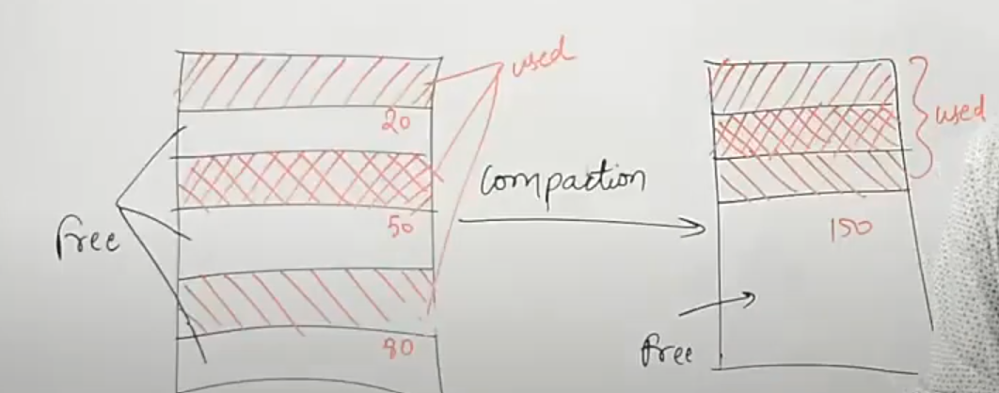

# Operating-System

Operating System is a system software which manages hardware and software resources of the computer system.It acts as interface between user and hardware resources. OS works on System Calls.

# Primary Goal :
(1) Convenience 
<br>

(2) Throughput : It is the no of execution executed per unit time.
<br>

Note : At present Linux has best throughput as compared to other os.

# Purpose of OS :
It controls all the computer resources.
<br>
It provides valuable services to user programs.
<br>
It coordinates the execution of user programs.
<br>
It provides resources for user programs.
<br>
It provides an interface (virtual machine) to the user.
<br>
It hides the complexity of software.
<br>
It supports multiple execution modes.
<br>
It monitors the execution of user programs to prevent errors.


# Functionality Of OS :
1. Resource Management: (hardware management like managing cpu)
<br>

2. Process Management: (cpu scheduling)
<br>

3. Storage Management :(File System )
<br>

4. Memory Management : (RAM , multitasking)
<br>

5. Security and Privacy : (Admin Password)

# Os structure 

# Os Operations: dual and multimode : 

Multimode operations in an operating system refer to the system's ability to operate in multiple modes, typically user mode and kernel mode, allowing it to efficiently and securely manage resources while differentiating between user-level and system-level operations. Multimode operations enhance security and stability by restricting certain operations based on the mode the system is in, reducing the risk of unauthorized access or system failures.
<br>
Key Modes in Multimode Operations
User Mode:

In user mode, applications and processes run with limited privileges and access only certain parts of memory and specific system resources.
The operating system restricts user mode processes to prevent them from executing critical system instructions that could affect the entire system or access protected memory areas.
When a user-mode application needs to perform a restricted operation, it makes a system call to request access, which the OS then handles.
<br>
Kernel Mode:

Kernel mode, also known as privileged mode or supervisor mode, gives the operating system full access to all system resources, including hardware components (like CPU and memory) and critical OS services.
The OS kernel executes in this mode, allowing it to perform privileged instructions (e.g., direct access to hardware, process management, memory allocation).
Kernel mode is typically reserved for the core OS, drivers, and other critical system-level code.

<br>
Additional Modes in Some Systems.
Certain modern systems and processors support additional modes to improve security, resource management, and efficiency:
<br>
Virtualization Mode (or Hypervisor Mode):

Used by virtualized environments, where a hypervisor controls multiple virtual machines (VMs), each running its OS.
This mode enables the hypervisor to manage access to hardware resources, allowing multiple OS instances to coexist securely and efficiently on the same hardware.
<br>
Secure Mode:

Found in secure systems (e.g., ARM TrustZone), where the processor can switch to a secure mode to handle sensitive data and operations.
This mode allows secure execution of applications that require protection from potentially untrusted software running in normal (non-secure) mode.

<br>
Why Multimode Operations Are Essential
Security: By restricting direct access to hardware and critical system instructions in user mode, the OS protects the system from accidental or malicious damage.
<br>
System Stability: Only trusted OS processes or privileged instructions run in kernel mode, reducing the chances of user applications causing system crashes or failures.
<br>
Resource Management: The OS can control access to resources more effectively, enforcing permissions and protecting memory from unauthorized access.
<br>
How Mode Switching Works
<br>
Mode Switching: When a user-mode process needs to perform an operation that requires higher privileges (like accessing hardware), it issues a system call that transitions the CPU to kernel mode.
After completing the requested operation, the OS returns to user mode, where the process can continue executing its non-privileged instructions.
<br>
Examples of Multimode Operations in Practice
<br>
System Calls: System calls trigger mode switches, allowing user-mode applications to request kernel-mode services (e.g., file I/O, network communication).
<br>
Exception Handling: Exceptions (like dividing by zero) prompt a mode switch to allow the OS to handle the exception in kernel mode.
<br>
Interrupt Handling: Hardware interrupts also switch the CPU to kernel mode so that the OS can manage the interrupt safely.
<br>
Benefits and Drawbacks of Multimode Operations:

Benefits: Multimode operations improve security, stability, and efficient resource use by limiting critical operations to kernel mode.
<br>
Drawbacks: Mode switching incurs a performance overhead, as the CPU must save and restore states during transitions between user and kernel modes.

# Os as resource managers:
Resource Management in Operating System is the process to manage all the resources efficiently like CPU, memory, input/output devices, and other hardware resources among the various programs and processes running in the computer.

Resource management is an important thing because resources of a computer are limited and multiple processes or users may require access to the same resources like CPU, memory etc. at the same time. The operating system has to manage and ensure that all processes get the resources they need to execute, without any problems like deadlocks. 

# Types of Operating System :
1. Batch Os : In this os , similar types of jobs were batched together and executed in one time.The system put all of the jobs in a queue on the basis of first come first serve and then executes the jobs one by one.
<br>

Note : Each process needs two types of system time: CPU time and IO time.
<br>
Note : Program on execution is called as process.
<br>
2. Multiprogramming os : In this os , there are n no of instructions are stored in RAM and when the first process is either completed or go for I/O then in this conditions cpu goes to executes another instructions.   

<br>

3. Multiprocessing Os :  There are more than one processors present in the system which executes more than one process at a time.
<br>

4. Multitasking Os : It allows a user to perform more than one computer task at the same time. In this Os, CPU provides some amount of time(a time quantum) to each process present in RAM. It is more responsive towards process.like server.
<br>

5. Network Os : An Operating system, which includes software and associated protocols to communicate with other computers and share their resources to each other via a network conveniently . Clusterd os is an example of this type of system (in this os , several devices are connect to same local network for execution process.)
<br>

6. Real Time Os : In Real-Time Systems, each job carries a certain deadline within which the job is supposed to be completed, otherwise, the huge loss will be there, or even if the result is produced, it will be completely useless. It is of three types :
(I) Soft RTOS : like online transaction (instruction may some delay)
(II) Hard RTOS : like missile system (instruction within a deadline)
(III) Firm RTOS : like ticket reservation (the output will changes if process is completed after the deadline )
<br>

7. Distributed OS : The Distributed Operating system is not installed on a single machine, it is divided into parts, and these parts are loaded on different machines. A part of the distributed Operating system is installed on each machine to make their communication possible.


<br>

# Process management in os :

# Attributes of a process :

# Process States :

# Process Schedular :

# Process Queues :

# Time related to Queues :

Completion Time : The time at which a particular process is completed.
<br>


# CPU Scheduling :
why do we need cpu Scheduling :
<br>
In some cases like when a process has more burst time then other process will starve.

# CPU scheduling Algorithm: 

1. First come first serve

<br>

2. Shortest Job First:
<br>

3. Shortest Remaining time first:
<br>

4. Round Robin :

<br>

5. Priority based Algorithm :
<br>

6. Highest Response Ratio time next:

# Software Solution to prevent race condition:

Race conditions occurs when multiple process using same system varibles at the same time .
<br>
1 <b>Lock Variable :</b>
<br>
Porperties that needs to be satisfied for the solution of race condition:
<br>
Mutual Exclusion : Not satisfied in all condition
<br>
Progress :satisfied
<br>
Bounded Waiting : satisfied


<br>
2 <b>Test Set Lock Mechanism</b>
<br>
Properties:
<br>
Mutual Exclusion :satisfied
<br>
Progress : satisfied
<br>
Bounded Waiting : not satisfied
<br>

```bash
// Pseudocode
lock = false;
while(test_set(lock)):
// critical section
lock = false // exit secion


def function(target):
    temp = target
    lock = true
    return temp

```


3.<b>Turn Variable Approach :</b>
<br>
For two process
<br>
Mutual Exclusion : satisfied
<br>
we can check mutual exclusion is satisfied by checking the multiple process enters into the critical section.

<br>
Progress : not satisfied in all condition because spin lock is caused.
<br>
We can check the Progress conditions by altering the process to enter into the critcal sections (if there are two process then intially allows the first process to enter into cs and then check if intially second process enters into the cs then does first blocks the first process or not).
<br>

Bounded Waiting : satisfied (It means that everytime only one process is not executing).
<br>
We can check the Bounded waiting conditions by ensuring that any process should not wait more than a max-limit.
This can be checked by allowing the same process to enter into the cs twice after IO.
<br>

4.<b>Interested Variable Mechanism :</b>
<br>
For two process
<br>
Mutual Exclusion : satisfied
<br>
Progress : satisfied
<br>
Bounded Waiting : not satisfied  because dead lock is caused.

5.<b>Paterson Solution :</b>
<br>
For two process
<br>
Mutual Exclusion : satisfied
<br>
Progress : satisfied
<br>
Bounded Waiting : satisfied

# Hardware solution to prevent race conditions :
Semaphore: It is an integer variable which is used in mutual exclusive manner by various concurrent cooperative proeces in order to achieve synchronization  or we can say it  is used to prevent race condition.

<br>
There are two types of Semaphore :
<br>
1.Binary Semaphore :

```bash
// wait or down or p function  or we can say entry section pseudocode

p(semaphore s){
if(s.value == 1 ){
   disable_interrupts();  // Prevent preemption or interrupts
   s.value = 0;
}
else
{
    // block this process and place this in suspend list
    sleep();

}
 enable_interrupts();   // Re-enable interrupts
}


// up or signal or v function or we can say that exit section pseudocode
v(sempahore s){ 
if(suspend list is empty){
   s.value = 1 ;
}
else{
   // select a process from suspend list.
   wakeUp();
}

}
```


<br>
Note : In binary semaphores, the checking and setting of the semaphore value are atomic operations. This ensures that mutual exclusion is preserved, and race conditions are avoided.In some systems, semaphores are managed by the operating system kernel, which ensures atomicity via interrupt disabling or through the use of spinlocks or mutexes. The OS guarantees that a semaphore's wait() (or P()) and signal() (or V()) operations are performed without interruption, ensuring that the semaphore value cannot be changed by other processes during these operations.


<br>
When it is implemented at user level then checking and setting the semaphore value should be atomic.
<br>
2. Counting Semaphore :
semaphore can be any integer value.

# DeadLock :
It is a situation where no process got blocked and no process proceeds. All process are continuously waiting for infinite time.

# DeadLock Handling strategies :
# 1. Deadlock Ignorance :
# 2. Deadlock Prevention: 
<br>
In deadlock Prevention we need to false any of four conditions from (Mutual exclusion, Hold and Wait , No preemption,circular wait.)
<br>
1. Mutual Exclusion : To make it false we have to make all resources are sharable .But there some resources which are not sharable like printer,tapeDrive etc because these resources cannot shared by more than process ar a time.
<br>
2. Hold and Wait :
To make it false when a process comes we provide all the resources what the process is demanding. But practically it is not possible because if we provide all resources to a single process then all other process will continuously waiting.
<br>

3. No preemption : 
To make it false we need to preempt a process from a cylic wait to prevent deadlock. This is not a good approach at all since if we take a resource away which is being used by the process then all the work which it has done till now can become inconsistent.

<br>
Remember that when we take resource from a process the process will go again in the ready queue.
<br>
Consider a printer is being used by any process. If we take the printer away from that process and assign it to some other process then all the data which has been printed can become inconsistent and ineffective and also the fact that the process can't start printing again from where it has left which causes performance inefficiency.

<br>

4. Circular wait :
To violate circular wait, we can assign a priority number to each of the resource. A process can't request for a lesser priority resource. This ensures that not a single process can request a resource which is being utilized by some other process and no cycle will be formed.
<br>
Among all the methods, violating Circular wait is the only approach that can be implemented practically.

# Deadlock Avoidance 
RGA , Banker's algorithms 

# Deadlock Detection and Recovery 

# System Calls :
A system call in an operating system (OS) is a mechanism that allows a user-space program to request a service or resource from the kernel, which operates in a more privileged mode. These services include tasks like file handling, memory management, process control, networking, and device I/O.

<br>
<b>User Mode vs. Kernel Mode:</b>
<br>
In a modern OS, applications run in user mode with limited access to hardware and system resources, while the kernel runs in kernel mode with full access to those resources. A system call transitions the program from user mode to kernel mode.

# Types of System calls :
File management: It is used to handle files.
examples are : open(), read(), write(), createFile() , close()
<br>

Device Management : It is used to take the previleges for the use of system devices like printer.
examples are : read() , write(), Reposition(),ioctl() etc. Here ioctl means input-output control.

<br>
Process management: It is used to direct the process. one example is like to load a process to a main memory. 
exmaples are : fork(), exec(), exit(), wait()
<br>
 
Information Maintenance : It is used to get the information about the process (we can say metadata).
Examples are : getPId(),attributes,get system time and data.

<br>

Communication related : It is used for the intercommunication process.
examples are :  pipe(),create/delete connection etc

<br>
There are also some Protection and Security related system calls.


# Memory Management :

# Fixed Partition : 

# Dynamic Partition : 
Note : The size of each partition will be equal to the size of the process.

# Compaction : 
It means put all the used partition(partition loaded with process) at one end create a big free area of all the unused partition at other end for new process.

<br>


<br>
It is also called Defragmentation.
<br>
It is a technique to remove the external fragmentation from Dynamic partition.

# Disadvantages of Compaction : 
It takes a lot of cpu utilization 
<br>
only possible when process supports supports dynamic reallocation.
for ex : dynamically reallocation is possible in Arraylist in java program.
<br>
dynamically reallocation is not possible in Array in java program because of static memory management.

# 
The Main concern for dynamic partitioning is keeping track of all the free and allocated partitions. However, the Operating system uses following data structures for this task.
<br>
1. Bit Map
<br>

2. Linked List : It is more prefered because it stores the additional information.
In Linked list , Doubly linked List is more prefered because it also looks for the linkedlist before itself and checks if it is also empty or not then if present node and previous node are empty then both the node combined and becomes one node.

# Partitioning Algorithms 
These algorithm can apply on both fixed and Dynamic partition.
1.First fit Algorithms
<br>
2. Next Fit Algorithms 
<br>
3. Best fit Algorithms :
<br>
Disadvantages of Best Fit Algorithms:
<br>
1. It is slower because it scans the entire list every time and tries to find out the smallest hole which can satisfy the requirement the process.
2. Due to the fact that the difference between the whole size and the process size is very small, the holes produced will be as small as it cannot be used to load any process and therefore it remains useless.
Despite of the fact that the name of the algorithm is best fit, It is not the best algorithm among all.


# Paging  :
Paging is a storage mechanism used to retrieve processes from the secondary storage into the main memory in the form of pages.
<b>Imp Point :</b>
<br>
The memory provide for each programe is called Virtual memory(logical address space).
<br>
while dividing the process into pages the frame size must be equal to size of page size.
<br>
CPU always works on logical address and Memmory works on physical address.
<br>
frame offset and Page offset is always same.
<br>
The operating system maintains a page table for each process.


<br>
<b>Very Important Point</b>
<br>
Before loading a program into the main memory the os allocates a virtual address space .Virtual address space is the set of all addresses that a process can use to access memory.
<br>
Suppose a 32-bit process has a virtual address space of 4 GB:
<br>
The lower portion might be allocated for code (e.g., 0x00000000 to 0x00400000).
The data segment might occupy the next part (e.g., 0x00400000 to 0x00500000).
The heap grows upwards from a certain point (e.g., 0x00500000).
The stack might start at the higher end of the address space and grow downwards (e.g., from 0xFFFF0000 downwards).
<br>
these virtual address space of a process is divided into fixed-size blocks known as pages.
After dividing the virtual address space into pages (paging), memory management unit converts virtual addresses to physical addresses to load pages into main memory as needed.

<b>Word:</b>

A word is the natural data unit used by a CPU for processing. Its size can vary depending on the architecture (e.g., 4 bytes in a 32-bit architecture or 8 bytes in a 64-bit architecture).
<br>
The word size is the amount of data that the CPU can handle in a single operation, often aligning with the CPU's register size.
<br>
Page Table : Page Table is a data structure used by the virtual memory system to store the mapping between logical addresses and physical addresses.
<br>
Logical Address = n bits  
<br>
logical address space is size of process. 
<br>
Logical Address space = 2 ^ n bytes 
<br>
This is same for the physical address space.
<br>
example : 
let Logical Address = 24bit 
let Page size = 4KB 
Page Offset = 12
One Page Entry  = 1 Byte 
<br>
then logical address space = 2^24 Byte
<br>
No of bit required to represent a page = logical address - Page offset => 24 -12 = 12 
<br>
Total No of Pages = 2^12 Byte
<br>
Size of Page Table = Total No of pages * Size of one Page Entry => 2^12 * 1 = 2^12 Byte = 4KB
<br>
If size of a page entry is not given then 
<br>
Size of table is calculated by the  => Total No of pages * No of bit required to represent a single frame.

# Demand Paging 

# 
