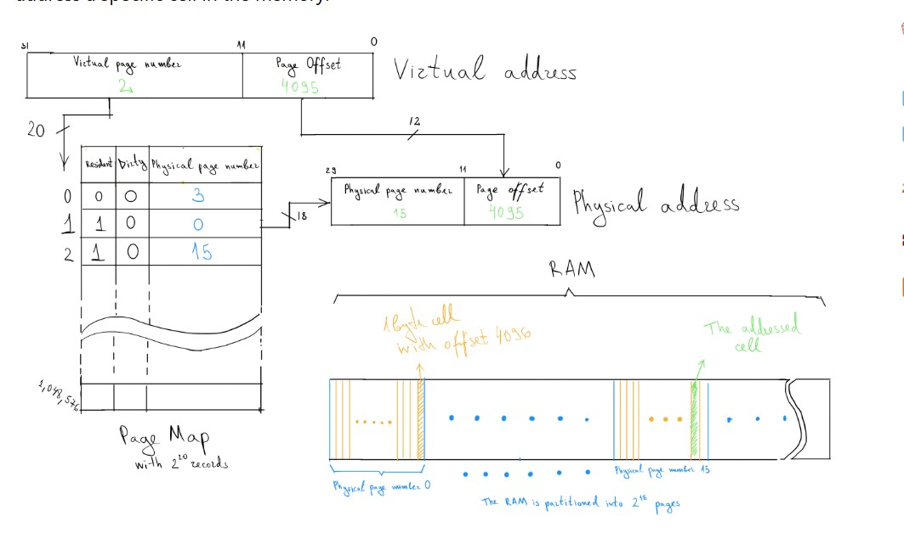

# Operating-System

Operating System is a system software which manages hardware and software resources of the computer system.It acts as interface between user and hardware resources. OS works on System Calls.

# Primary Goal :
(1) Convenience 
<br>

(2) Throughput : It is the no of execution executed per unit time.
<br>

Note : At present Linux has best throughput as compared to other os.

# Purpose of OS :
It controls all the computer resources.
<br>
It provides valuable services to user programs.
<br>
It coordinates the execution of user programs.
<br>
It provides resources for user programs.
<br>
It provides an interface (virtual machine) to the user.
<br>
It hides the complexity of software.
<br>
It supports multiple execution modes.
<br>
It monitors the execution of user programs to prevent errors.


# Functionality Of OS :
1. Resource Management: (hardware management like managing cpu)
<br>

2. Process Management: (cpu scheduling)
<br>

3. Storage Management :(File System )
<br>

4. Memory Management : (RAM , multitasking)
<br>

5. Security and Privacy : (Admin Password)

# Os structure : 
 <br>
1. Simple Structure : This simple structure was followed by the old os like ms-dos . In this archiecture there are  four levels and all the three levels have direct access to base hardware layer(last level) . It is vulnerable to malicious program because if the application program fails then whole os will crash.

<br>
 <br>
2. Monolithic Structure : This structure was followed by the earlier Unix operating system. In this archietecture there are two layers- one layer is system interface and other layer is kernel. This system is difficult to maintain and implemented because there are too many functionality are packed at kernel level and if there is an issue in cpu scheduling algorithm then we will have to touch entire kernel level and it is very difficult to implement. 
ex => Linux os .
<br>
 <br>
3. Layered Structure : In this structure , os is divided into layers . The layer 0 is the hardware layer and last layer is User Interface . This is an efficient structure because if there is a problem at a layer then it is easy to implemented. However this is not the best structure because it is very difficult to design the each layer as it is difficult to decide that which layer is at the top and which is at below that top layer because a layer can access only the layers that belows it. for example the backing storage layer must below the memory management layer.
This is also not more efficient because if a I/O process comes then it will have to use systems calls and hardware resource at layer 0 then system call will take more time to reach to the level 0.
example: Windows NT (here NT means New Technology).   
<br>
 <br>
4. Microkernels : In this Structure, there is a user mode level, a kernel mode level and hardware resource level. In this archierecture microkernel will provide only the core functionality and other functionality will be executed at user mode and the main function of the microkernel is to establishes a connection b/w client program and other device drivers/servers by messagse passing and this is its advantage. One of its Disadvantage is that Microkernels can suffers from performance decrease due to increase system function overhead because to provide functionality other than core functionlity, microkernels will have to pass messagse b/w client program and other device drivers/servers. example : L4Linux os .

br
Note : Message Passing : 

<br>

<br>
 <br>

5. Modules : It means modular approach is used in structuring of the OS. This is the best methodology for os design which involves using object oriented programming techniques to create modular kernel. In this Structure, we have a core kernel and this core kernel will have only the core functionality of the kernel and the other functionalities are present in the form of modules which will be loaded dynamically either at boot time or run time. 
example : sun solaris os .
# Os Operations: dual and multimode : 

Multimode operations in an operating system refer to the system's ability to operate in multiple modes, typically user mode and kernel mode, allowing it to efficiently and securely manage resources while differentiating between user-level and system-level operations. Multimode operations enhance security and stability by restricting certain operations based on the mode the system is in, reducing the risk of unauthorized access or system failures.
<br>
Key Modes in Multimode Operations
User Mode:

In user mode, applications and processes run with limited privileges and access only certain parts of memory and specific system resources.
The operating system restricts user mode processes to prevent them from executing critical system instructions that could affect the entire system or access protected memory areas.
When a user-mode application needs to perform a restricted operation, it makes a system call to request access, which the OS then handles.
<br>
Kernel Mode:

Kernel mode, also known as privileged mode or supervisor mode, gives the operating system full access to all system resources, including hardware components (like CPU and memory) and critical OS services.
The OS kernel executes in this mode, allowing it to perform privileged instructions (e.g., direct access to hardware, process management, memory allocation).
Kernel mode is typically reserved for the core OS, drivers, and other critical system-level code.

<br>
Additional Modes in Some Systems.
Certain modern systems and processors support additional modes to improve security, resource management, and efficiency:
<br>
Virtualization Mode (or Hypervisor Mode):

Used by virtualized environments, where a hypervisor controls multiple virtual machines (VMs), each running its OS.
This mode enables the hypervisor to manage access to hardware resources, allowing multiple OS instances to coexist securely and efficiently on the same hardware.
<br>
Secure Mode:

Found in secure systems (e.g., ARM TrustZone), where the processor can switch to a secure mode to handle sensitive data and operations.
This mode allows secure execution of applications that require protection from potentially untrusted software running in normal (non-secure) mode.

<br>
Why Multimode Operations Are Essential
Security: By restricting direct access to hardware and critical system instructions in user mode, the OS protects the system from accidental or malicious damage.
<br>
System Stability: Only trusted OS processes or privileged instructions run in kernel mode, reducing the chances of user applications causing system crashes or failures.
<br>
Resource Management: The OS can control access to resources more effectively, enforcing permissions and protecting memory from unauthorized access.
<br>
How Mode Switching Works
<br>
Mode Switching: When a user-mode process needs to perform an operation that requires higher privileges (like accessing hardware), it issues a system call that transitions the CPU to kernel mode.
After completing the requested operation, the OS returns to user mode, where the process can continue executing its non-privileged instructions.
<br>
Examples of Multimode Operations in Practice
<br>
System Calls: System calls trigger mode switches, allowing user-mode applications to request kernel-mode services (e.g., file I/O, network communication).
<br>
Exception Handling: Exceptions (like dividing by zero) prompt a mode switch to allow the OS to handle the exception in kernel mode.
<br>
Interrupt Handling: Hardware interrupts also switch the CPU to kernel mode so that the OS can manage the interrupt safely.
<br>
Benefits and Drawbacks of Multimode Operations:

Benefits: Multimode operations improve security, stability, and efficient resource use by limiting critical operations to kernel mode.
<br>
Drawbacks: Mode switching incurs a performance overhead, as the CPU must save and restore states during transitions between user and kernel modes.

# Os as resource managers:
Resource Management in Operating System is the process to manage all the resources efficiently like CPU, memory, input/output devices, and other hardware resources among the various programs and processes running in the computer.

Resource management is an important thing because resources of a computer are limited and multiple processes or users may require access to the same resources like CPU, memory etc. at the same time. The operating system has to manage and ensure that all processes get the resources they need to execute, without any problems like deadlocks. 

# Types of Operating System :
1. Batch Os : In this os , similar types of jobs were batched together and executed in one time.The system put all of the jobs in a queue on the basis of first come first serve and then executes the jobs one by one.
<br>

Note : Each process needs two types of system time: CPU time and IO time.
<br>
Note : Program on execution is called as process.
<br>
2. Multiprogramming os : In this os , there are n no of instructions are stored in RAM and when the first process is either completed or go for I/O then in this conditions cpu goes to executes another instructions.   

<br>

3. Multiprocessing Os :  There are more than one processors present in the system which executes more than one process at a time.
<br>

4. Multitasking Os : It allows a user to perform more than one computer task at the same time. In this Os, CPU provides some amount of time(a time quantum) to each process present in RAM. It is more responsive towards process.
<br>

5. Network Os : An Operating system, which includes software and associated protocols to communicate with other computers and share their resources to each other via a network conveniently . Clusterd os is an example of this type of system (in this os , several devices are connect to same local network for execution of process.)
<br>

6. Real Time Os : In Real-Time Systems, each job carries a certain deadline within which the job is supposed to be completed, otherwise, the huge loss will be there, or even if the result is produced, it will be completely useless. It is of three types :
(I) Soft RTOS : like online transaction (instruction may some delay)
(II) Hard RTOS : like missile system (instruction within a deadline)
(III) Firm RTOS : like ticket reservation (the output will changes if process is completed after the deadline )
<br>

7. Distributed OS : The Distributed Operating system is not installed on a single machine, it is divided into parts, and these parts are loaded on different machines. A part of the distributed Operating system is installed on each machine to make their communication possible.

8.Time Sharing Os :
A Time-Sharing Operating System allows multiple users to access the system concurrently, and this occurs by allocating a small time slice or quantum to each task.like server.

<br>

# Process management in os :

# Attributes of a process :

The Process Control Block (PCB) is a critical data structure in the operating system used to store information about a specific process. 
 
# Process States :

# Process Schedular :

# Process Queues :
The waiting queue exists in the kernel space of an operating system. It is part of the operating system's process management subsystem and is implemented as a data structure in the kernel memory.

# Process and Threads:
When the same type of task are repeated then we can make copy of same process or we can use multithreading.
<br>

<br>
<br>


# Threads :
Threads are lightweight units of execution within a process, sharing the same memory space and resources. It is also known as lightweight process.
<br>
Remember that threads are created and managed by application using thread library.

# Multithreading :
Multithreading is a technique used in operating systems to improve the performance and responsiveness of computer systems. Multithreading allows multiple threads (i.e., lightweight processes) to share the same resources of a single process, such as the CPU, memory, and I/O devices. For example, in a browser, multiple tabs can be different threads. MS Word uses multiple threads: one thread to format the text, another thread to process inputs, etc.

# Multithreading Models :
The Multithreading Model defines how threads are managed and mapped between user and kernel space in an operating system. This model impacts how threads perform, how they're scheduled, and how they interact with each other and system resources. There are three main multithreading models:
<br>
1. Many-to-One Model
In the many-to-one model, multiple user-level threads are mapped to a single kernel thread. The OS doesn't need to know about the individual user threads because they're managed entirely in user space by a user-level library.
<br>
Characteristics:
Only one user thread can access the kernel at a time.
The entire process blocks if a thread performs a blocking system call.
Efficient thread creation and management because no kernel involvement is required because it is implemented in user space.
Limited concurrency, as only one thread can run in the kernel at a time on a single CPU.
<br>
Use Case:
Mostly used in older systems or environments where concurrency is needed but full parallelism isn't essential.
Disadvantages:
Limited ability to utilize multicore systems since only one kernel thread represents all user threads.
A blocking call in one thread can block the entire process, affecting responsiveness.
<br>
2. One-to-One Model
In the one-to-one model, each user thread maps directly to a kernel thread. This model provides greater concurrency than the many-to-one model since multiple threads can run on multiple cores simultaneously.
<br>
Characteristics:
Each user thread is created as a separate kernel thread, allowing for true parallelism.
Blocking calls by one thread do not block other threads because each thread has its own kernel thread.
More control over threading since the OS can manage each thread individually.
Use Case:
Widely used in operating systems like Linux and Windows, where higher concurrency and parallelism are essential.
Disadvantages:
Thread creation is slower and consumes more resources since each thread needs kernel support.
Can lead to higher overhead due to the large number of kernel threads.
<br>
3. Many-to-Many Model
The many-to-many model provides a compromise between the many-to-one and one-to-one models by allowing multiple user-level threads to be mapped to a smaller or equal number of kernel threads. This enables the OS to manage user threads with greater flexibility.
<br>
Characteristics:
Multiple user threads can be executed in parallel on multiple kernel threads.
The system can dynamically allocate kernel threads based on the number of active user threads.
Efficient use of system resources and good concurrency without overwhelming the OS with excessive kernel threads.
Use Case:
Used in environments where a balance between resource management and parallelism is required. This model is also flexible for applications requiring various levels of concurrency.
Disadvantages:
Complexity in implementation due to the need for an intermediate layer to manage the mapping.
Requires the OS to have good support for managing the mapping, which can introduce overhead.


# Multicore Programming :
Multicore Programming refers to designing and implementing software that can take full advantage of systems with multiple CPU cores. This allows multiple tasks or parts of tasks to be executed simultaneously, improving performance and efficiency, especially for compute-intensive applications.
<br>
Key Concepts in Multicore Programming:

Parallelism:

Breaking a task into smaller sub-tasks that can run simultaneously on different cores.
Two types:
Data Parallelism: The same operation is performed on different pieces of data.
Task Parallelism: Different tasks or operations are performed in parallel.
Concurrency:

Managing multiple tasks that may or may not execute simultaneously but appear to progress in overlapping time periods.
<br>
A Multithreaded application running on a traditional single core chips would have to interleave(context switching between) the threads.

# Time related to Queues :

Completion Time : The time at which a particular process's execution is completed.
<br>


# CPU Scheduling :
why do we need cpu Scheduling :
<br>
In some cases like when a process has more burst time then other process will starve.

# CPU scheduling Algorithm: 

1. First come first serve

<br>

2. Shortest Job First:
<br>

3. Shortest Remaining time first:
<br>

4. Round Robin :

<br>

5. Priority based Algorithm :
<br>

6. Highest Response Ratio time next:

# Software Solution to prevent race condition:

Race conditions occurs when multiple process using same system varibles at the same time .
<br>
1 <b>Lock Variable :</b>
<br>
Porperties that needs to be satisfied for the solution of race condition:
<br>
Mutual Exclusion : Not satisfied in all condition
<br>
Progress :satisfied
<br>
Bounded Waiting : satisfied


<br>
2 <b>Test Set Lock Mechanism</b>
<br>
Properties:
<br>
Mutual Exclusion :satisfied
<br>
Progress : satisfied
<br>
Bounded Waiting : not satisfied
<br>

```bash
// Pseudocode


lock = false;
while(test_set(lock));
// critical section
lock = false // exit secion

def test_set(target):
    global lock
    temp = target
    lock = true
    return temp

```
<br>
Note : In Priority Inversion (Test set Lock Mechanism) spin lock is caused.
<br>
 
3.<b>Turn Variable Approach :</b>
<br>
For two process
<br>
Mutual Exclusion : satisfied
<br>
we can check mutual exclusion is satisfied by checking the multiple process enters into the critical section.

<br>
Progress : not satisfied in all condition .
<br>
We can check the Progress conditions by altering the process to enter into the critcal sections (if there are two process then intially allows the first process to enter into cs and then check if intially second process enters into the cs then does first blocks the second process or not).
<br> 

Bounded Waiting : satisfied (It means that everytime only one process is not executing).
<br>
We can check the Bounded waiting conditions by ensuring that any process should not wait more than a max-limit.
This can be checked by allowing the same process to enter into the cs twice after IO.
<br>

4.<b>Interested Variable Mechanism :</b>
<br>
For two process
<br>
Mutual Exclusion : satisfied
<br>
Progress : satisfied
<br>
Bounded Waiting : not satisfied  because dead lock is caused.
<br>Failure of Bounded Waiting in the Algorithm
The algorithm can fail to ensure bounded waiting due to a phenomenon called busy waiting and indefinite postponement. Here's why:

Scenario
Two processes, P0 and P1, want to enter the critical section:
Initial State:
interested[0] = false
interested[1] = false
P0 wants to enter:
P0 sets interested[0] = true.
It checks interested[1]. If interested[1] = false, it enters the critical section.
P1 wants to enter at the same time:
P1 sets interested[1] = true.
It checks interested[0]. Since P0 is already in the critical section, it cannot proceed.
Indefinite Postponement:
When P0 exits the critical section, it sets interested[0] = false.
However, if P0 immediately re-enters (e.g., it resets interested[0] = true before P1 can proceed), P1 might be perpetually blocked.
<br>
5.<b>Paterson Solution :</b>
<br>
For two process
<br>
Mutual Exclusion : satisfied
<br>
Progress : satisfied
<br>
Bounded Waiting : satisfied

# Hardware solution to prevent race conditions :
Semaphore: It is an integer variable which is used in mutual exclusive manner by various concurrent cooperative proeces in order to achieve synchronization  or we can say it  is used to prevent race condition.

<br>
There are two types of Semaphore :
<br>
1.Binary Semaphore :

```bash
// wait or down or p function  or we can say entry section pseudocode

p(semaphore s){
if(s.value == 1 ){
   disable_interrupts();  // Prevent preemption or interrupts
   s.value = 0;
}
else
{
    // block this process and place this in suspend list
    sleep();

}
 enable_interrupts();   // Re-enable interrupts
}


// up or signal or v function or we can say that exit section pseudocode
v(sempahore s){ 
if(suspend list is empty){
   s.value = 1 ;
}
else{
   // select a process from suspend list.
   wakeUp();
}

}
```


<br>
Note : In binary semaphores, the checking and setting of the semaphore value are atomic operations. This ensures that mutual exclusion is preserved, and race conditions are avoided.In some systems, semaphores are managed by the operating system kernel, which ensures atomicity via interrupt disabling or through the use of spinlocks or mutexes. The OS guarantees that a semaphore's wait() (or P()) and signal() (or V()) operations are performed without interruption, ensuring that the semaphore value cannot be changed by other processes during these operations.


<br>
When it is implemented at user level then checking and setting the semaphore value should be atomic.
<br>
2. Counting Semaphore :
semaphore can be any integer value (greater than or equal to 0 ).

# DeadLock :
It is a situation where no process got blocked and no process proceeds. All process are continuously waiting for infinite time.

# DeadLock Handling strategies :
# 1. Deadlock Ignorance :
# 2. Deadlock Prevention: 
<br>
In deadlock Prevention we need to false any of four conditions from (Mutual exclusion, Hold and Wait , No preemption,circular wait.)
<br>
1. Mutual Exclusion : To make it false we have to make all resources are sharable .But there some resources which are not sharable like printer,tapeDrive etc because these resources cannot shared by more than process at a time.
<br>
2. Hold and Wait :
To make it false when a process comes we provide all the resources what the process is demanding. But practically it is not possible because if we provide all resources to a single process then all other process will continuously waiting.
<br>

3. No preemption : 
To make it false we need to preempt a process from a cylic wait to prevent deadlock. This is not a good approach at all since if we take a resource away which is being used by the process then all the work which it has done till now can become inconsistent.

<br>
Remember that when we take resource from a process the process will go again in the ready queue.
<br>
Consider a printer is being used by any process. If we take the printer away from that process and assign it to some other process then all the data which has been printed can become inconsistent and ineffective and also the fact that the process can't start printing again from where it has left which causes performance inefficiency.

<br>

4. Circular wait :
To violate circular wait, we can assign a priority number to each of the resource. A process can't request for a lesser priority resource. This ensures that not a single process can request a resource which is being utilized by some other process and no cycle will be formed.
<br>
Among all the methods, violating Circular wait is the only approach that can be implemented practically.

# Deadlock Avoidance 
RAG , Banker's algorithms 

# Deadlock Detection and Recovery 
RAG , Bankers's Algorithm
# System Calls :
A system call in an operating system (OS) is a mechanism that allows a user-space program to request a service or resource from the kernel, which operates in a more privileged mode. These services include tasks like file handling, memory management, process control, networking, and device I/O.

<br>
<b>User Mode vs. Kernel Mode:</b>
<br>
In a modern OS, applications run in user mode with limited access to hardware and system resources, while the kernel runs in kernel mode with full access to those resources. A system call transitions the program from user mode to kernel mode.

# Types of System calls :
File management: It is used to handle files.
examples are : open(), read(), write(), createFile() , close()
<br>

Device Management : It is used to gives the previleges for the use of system devices like printer.
examples are : read() , write(), Reposition(),ioctl() etc. Here ioctl means input-output control.

<br>
Process management/Process Control: It is used to direct the process. one example is like to load a process to a main memory. 
exmaples are : fork(), exec(), exit(), wait()
<br>
The fork system call is used to create a new process by duplicating the calling process.
<br>
When fork is called, it creates a child process that is a copy of the parent process.
<br>
The exec system call is used to replace the current process memory with a new process memory.
<br>
 
Information Maintenance : It is used to get the information about the process (we can say metadata).
Examples are : getPId(),attributes,get system time and date.

<br>

Inter-Process Communication related : It is used for the intercommunication process.
examples are :  pipe(),create/delete connection etc
<br>
The pipe() system call in Unix/Linux is used to create a unidirectional communication channel between processes, typically parent and child processes. It provides a mechanism for processes to exchange data by reading and writing to a shared memory buffer.
<br>

Protection and Security related : There are also some Protection and Security related system calls.
example are : chmod() which changes the ownership of a file or directory, allowing control over who has administrative rights to it.

<br>
For more details: https://www.geeksforgeeks.org/introduction-of-system-call/


# Memory Management :

# Fixed Partition : 

# Dynamic Partition : 
Note : The size of each partition will be equal to the size of the process.

# Compaction : 
It means put all the used partition(partition loaded with process) at one end and create a big free area of all the unused partition at other end for new process.

<br>


<br>
It is also called Defragmentation.
<br>
It is a technique to remove the external fragmentation from Dynamic partition.

# Disadvantages of Compaction : 
It takes a lot of cpu utilization.
<br>
only possible when process supports dynamic reallocation.
Dynamic reallocation in a process refers to the ability to adjust the allocation of memory or other resources during the runtime of a program,
for ex : dynamically reallocation is possible in Arraylist in java program.
<br>
dynamically reallocation is not possible in Array in java program because of static memory management.

# Data Structure used to represent partition:
The Main concern for dynamic partitioning is keeping track of all the free and allocated partitions. However, the Operating system uses following data structures for this task.
<br>
1. Bit Map
<br>

2. Linked List : It is more prefered because it stores the additional information.
In Linked list , Doubly linked List is more prefered because it also looks for the linkedlist before itself and checks if it is also empty or not then if present node and previous node are empty then both the node combined and becomes one node.

# Partitioning Algorithms 
These algorithm can apply on both fixed and Dynamic partition.
1.First fit Algorithms
<br>
2. Next Fit Algorithms 
<br>
3. Best fit Algorithms :
<br>
Disadvantages of Best Fit Algorithms:
<br>
1. It is slower because it scans the entire list every time and tries to find out the smallest hole which can satisfy the requirement the process.
2. Due to the fact that the difference between the whole size and the process size is very small, the holes produced will be as small as it cannot be used to load any process and therefore it remains useless.
Despite of the fact that the name of the algorithm is best fit, It is not the best algorithm among all.
<br>

In Quick fit algorithm : The memory manager maintains separate lists of free memory blocks for commonly requested sizes (e.g., 4 KB, 8 KB, 16 KB, etc.).
This avoids the need to search the entire list of free blocks for a suitable partition size during allocation.


# Paging  :
Paging is a storage mechanism used to retrieve processes from the secondary storage into the main memory in the form of pages.
<b>Imp Point :</b>
<br>
The memory provide for each programe is called Virtual memory(logical address space).
<br>
while dividing the process into pages the frame size must be equal to size of page size.
<br>
CPU always works on logical address and Memmory works on physical address.
<br>
frame offset and Page offset is always same.
<br>
The operating system maintains a page table for each process.


<br>
<b>Very Important Point</b>
<br>
Before loading a program into the main memory the os creates process and allocates a virtual address space. Virtual address space is the set of all addresses(range of address) that a process can use to access memory.
<br>
Suppose a 32-bit process has a virtual address space of 4 GB:
<br>
The lower portion might be allocated for code (e.g., 0x00000000 to 0x00400000).
The data segment might occupy the next part (e.g., 0x00400000 to 0x00500000).
The heap grows upwards from a certain point (e.g., 0x00500000).
The stack might start at the higher end of the address space and grow downwards (e.g., from 0xFFFF0000 downwards).
<br>
these virtual address space of a process is divided into fixed-size blocks known as pages.
After dividing the virtual address space into pages (paging), some pages are loaded into the primary memory and some pages are stored into virtual memory.
<b>Word:</b>

A word is the natural data unit used by a CPU for processing. Its size can vary depending on the architecture (e.g., 4 bytes in a 32-bit architecture or 8 bytes in a 64-bit architecture).
<br>
The word size is the amount of data that the CPU can handle in a single operation, often aligning with the CPU's register size.
or 
It is the minimum unit to represent the memory.
<br>
Page Table : Page Table is a data structure used by the operating system which helps MMU in mapping between logical addresses and physical addresses.
<br>
Logical Address = n bits  
<br>
logical address space is size of process. 
<br>
Logical Address space = 2 ^ n bytes 
<br>
This is same for the physical address space.
<br>

<br>
The virtual page number is passed to the pagemap using 20 address bits. Since the page number is passed in binary having 20 address bits means that the pagemap can have up to 2^20 records (since with 20 bits you can get 2^20 different numbers) This is also the reason why the page numbers are powers of 2.
<br>
Also the page offset defines the page size since 12 bits for offset means that we can address 2^12 = 4096 cells.
<br>
example : 
let Logical Address = 24bit 
let Page size = 4KB 
Page Offset = 12
One Page Entry  = 1 Byte 
<br>
then logical address space = 2^24 Byte
<br>
No of bit required to represent a page = logical address - Page offset => 24 -12 = 12 
<br>
No of Pages = 2 ^ No of bit required to represent a page 
<br>
We can also calculate the No of pages = Logical Adress space/Size of 1 page 
<br>
Size of Page Table = Total No of pages * Size of one Page Entry => 2^12 * 1 = 2^12 Byte = 4KB
<br>
If size of a page entry is not given then 
<br>
Size of table is calculated by the  => Total No of pages * No of bit require to represent a single frame.

# Demand Paging 
# Causes of Thrashing
Insufficient Physical Memory (RAM):

When the system's memory is overcommitted, and the active processes collectively require more memory than is available in RAM.
<br>
High Degree of Multiprogramming:

Too many processes running simultaneously, leading to frequent page faults as processes compete for memory.
<br>
Improper Page Replacement Policy:

Inefficient or overly aggressive page replacement algorithms can increase the frequency of page faults.
<br>
Large Working Sets:
When processes require large amounts of memory (working sets), and the system cannot accommodate all of them in RAM.

# Detection of Thrashing
The system can detect thrashing by monitoring the following indicators:
<br>
High Page Fault Rate:

A significant increase in the frequency of page faults without corresponding improvements in system throughput.
<br>
Decreased CPU Utilization:

The CPU remains idle or underutilized because it spends most of its time waiting for memory operations to complete.


# Ways to Eliminate Thrashing :
Adjust the swap file size:If the system swap file is not configured correctly, disk thrashing can also happen to you.
<br>
A swap file (or swap space) is a portion of the storage disk that is used as virtual memory when a computer's physical RAM (Random Access Memory) is full.

# How to Prevent Thrashsing:
1. Locality Model
<br>
Concept:
The locality model is based on the observation that a process does not access all of its pages uniformly at all times. Instead, it accesses a subset of pages (called a locality) during a specific phase of execution.
By keeping the pages of the current locality in memory, the system can minimize page faults and prevent thrashing.
<br>
Key Ideas:

Locality:

A set of pages that a process frequently uses during a particular phase of its execution.
Localities change over time as the process transitions between different phases (e.g., initialization, computation, or I/O).
<br>
Dynamic Adjustment:

The operating system dynamically detects the active locality of a process and ensures that enough frames are allocated to hold it.
<br>
Advantages:
<br>
Prevents unnecessary page replacements by focusing on keeping the currently needed pages in memory.
Reduces the risk of thrashing by ensuring that only essential pages are swapped in and out.
<br>
<br>
2. Working Set Model
<br>
Concept:

The working set model tracks the set of pages a process has recently accessed, called the working set. By ensuring the working set of each active process fits in memory, the system can avoid thrashing.
<br>

Details:

Working Set Definition:

A process's working set 
W(t,Δ) at time t is the set of all pages the process accessed in the last Δ time units.
<br>
Key Parameters:
Δ: The window size, which determines how far back in time to look for memory references.
A small Δ may exclude some active pages(For example, if a process frequently cycles through 10 pages, but a small 
Δ only captures the last 5 pages, the system might erroneously assume the process only needs those 5 pages.), 
while a large Δ may include unnecessary pages(For example, if a process accessed 20 pages over a large 
Δ, but only 10 pages are currently in active use, the system will allocate memory for all 20 pages.).
<br>
Operating System Actions:

Periodically calculate the working set for each process.
Allocate enough frames to each process to accommodate its working set.
Suspend or swap out processes whose working sets cannot fit in memory.
<br>
Advantages:

Dynamically adjusts memory allocation based on actual process behavior.
Provides a balance between minimizing page faults and avoiding over-allocation of memory.
<br>
Challenges:

Maintaining and calculating the working set can add overhead.

<br><br>
3. Page Fault Frequency (PFF)
<br>
Concept:

The Page Fault Frequency (PFF) approach directly monitors the rate of page faults for each process. Based on the frequency, the operating system adjusts the number of frames allocated to the process.
Details:
<br>
Page Fault Rate:

If the page fault rate for a process exceeds a predefined upper threshold, it indicates that the process does not have enough frames.
If the page fault rate falls below a lower threshold, it indicates that the process has more frames than needed.
<br>
Adjustments:
High Page Fault Rate:
Allocate more frames to the process to reduce page faults.
Low Page Fault Rate:
Remove excess frames from the process and reallocate them to other processes that might need them more.
<br>
Advantages:

Simple and effective in managing memory allocation.
Reduces thrashing by dynamically balancing memory among processes based on their actual needs.
<br>
Challenges:

Requires careful tuning of thresholds to prevent overreaction.


# File System : 
It is a module present in almost all of the os . It basically divides the files logically into blocks and map it to the sectors of the hard disk .In this way it is used to store the file and fetch the files.

# Properties of File :
Identifiers : A unique no is assigned to each file within a specific file system.

<br>
Type(Extension): 
Along with the name, Each File has its own extension which identifies the type of the file. For example, a text file has the extension .txt, A video file can have the extension .mp4.

# Operations on file :
Reposition  : when os starts reading a file then by default pointer is at the base address or first word and this pointer can moved to last or to some other position to skip some word and this is called reposition.

# Allocation method :
1. Contiguous Allocation method 
<br>
2. Non Contiguous Allocation method :
likedlist allocation and Indexed allocation are comes under this type of allocation.

# File Access methods 
# Directory Structure 
# Directory Structure
# Magnetic Disk :
It is a storage device which provides large amount of secondary storage to modern computer.

<br>

<br>
Platter : A round surface(disk) containing magnetic coating.
<br>
Track : A circle on the disk surface which contains data is called track.
<br>
Sectors : It is a portion of track on the disk surface.Each sectors stores the same no of bytes . So the density of bits(information) is more in sectors near the center of disk . 

<br>
Cylinder : set of concentric track accessed simultaneously from read and write head.

<br>
Block : The smallest unit of data that can be written or read to/from the disk.
<br>

Read/Write Head : A transducer(reads the data and converts into electric signal) attached to an arm for reading/writing to/from the disk surface.

<br>
Arm Assembly : A mechanical unit holding all heads and arms.

<br>
Drive motor : It rotates the platter at a fixed speed . 
<br>
Head Motion : It is a mechanism required to move the head assembly in and out. 
<br>
Seek time : Time required by read and write head to move to correct tracks.
<br>

Latency Time : Time taken by the correct sectors to arrive under read/write head at correct tracks. It is also called rotational delay.

<br>
Latency Time  =  1/rotational speed
<br>
Average Latency Time  = 1/2 * 1/rotational speed

<br>

Average Access Time : It is the total time required by read/write head in reading/ writing data to/from the disk . 

<br>

Average Access time  = average seek_time + average Latency_time + Data_transfer_time + controller_overhead + queue_delay 

<br>
Data transfer time in a magnetic disk refers to the time required to transfer data between the disk's storage media and the computer's main memory once the data location is identified and ready for transfer. 
<br>  
Data_transfer_time = 1/(No. of Sectors * rotational speed ) 

<br>
Data_transfer_rate = It refers to the no of bits that can be transferred per second . 
<br>
Data_transfer_rate =   No of rotations/sec  * track capacity * no of heads


# Disk Scheduling Algorithm
